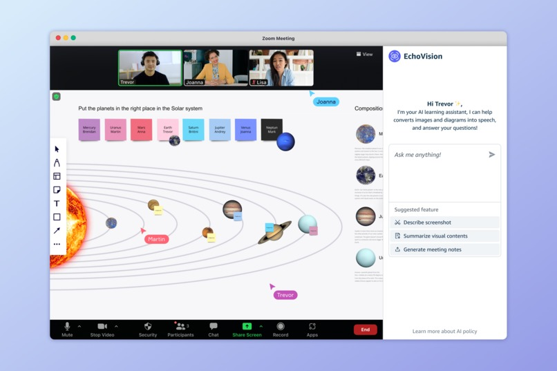

# EchoVision

A full-stack screen-capture &amp; AI-analysis toolkit: a Tampermonkey userscript to grab on-screen content from any web app, and a Flask/AWS Bedrock backend that delivers accessibility-focused insights.

# How we built it

When an image is detected, it’s sent to an AWS Lambda function, which calls Amazon Bedrock to generate a text description. The result is stored in S3, then passed to Amazon Polly to produce audio, which is played back to the user in real time.

# What it does

EchoVision is an AI-powered browser plugin that converts images shown during online classes into descriptive audio, in real time. It detects visual content (including uploaded slides, shared screens, or in-browser images), extracts meaningful context, and provides accurate, dynamic audio narration. It’s designed to work seamlessly with screen readers and helps all learners better access visual information.

